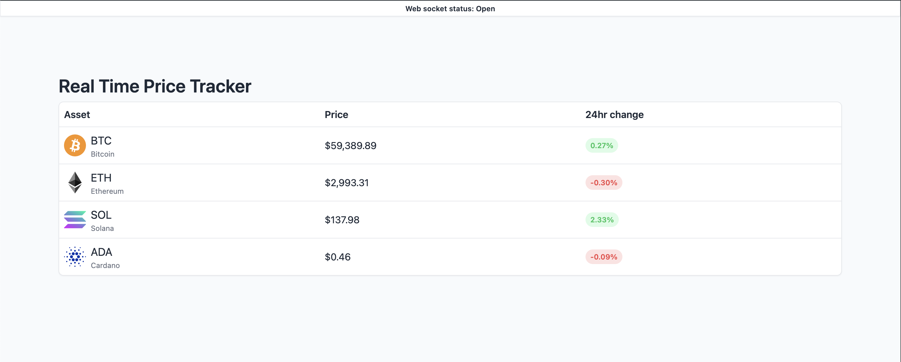
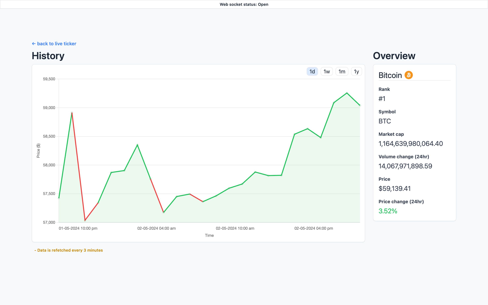

# RealTimePriceTracker

RealTimePriceTracker is a streamlined, multi-page web application built with React that tracks and displays the real-time prices of Bitcoin, Ethereum, Solana, and Cardano. It showcases the ability to work with React, Next, APIs, WebSockets, routing, and unit tests.

## Features

- Tracks and displays real-time prices of selected cryptocurrencies.
- Supports WebSocket for real-time updates.
- Implements a simple navigation structure with Home and Details pages.
- Includes unit tests for key components and functionality.

## Technologies Used

- React: React is a popular JavaScript library for building user interfaces. Its component-based architecture makes it well-suited for modular development and efficient rendering.

- Zustand (for state management): Zustand is a lightweight state management library for React that emphasizes simplicity and minimalism. It allows for managing state without the complexity of larger state management solutions like Redux. In this application, Zustand is used to share the real-time prices of cryptocurrencies across the entire application.

- Next.js (for routing and server-side rendering): Next.js is a React framework that provides features like server-side rendering, automatic code splitting, and simplified routing. It simplifies the setup of routing and can improve SEO and performance optimization.

- WebSocket API (for real-time updates): The RealTimePriceTracker uses the Binance WebSocket API to fetch real-time data for selected cryptocurrencies. The application subscribes to the `24hrTicker` endpoint, which provides 24-hour rolling window ticker statistics. The `react-use-websocket` library is used to handle WebSocket connections and messages in a React context. This library provides a custom React Hook that makes it easy to connect to a WebSocket server, send messages, and listen for responses, all within the familiar context of React component lifecycle. The WebSocket connection is configured to automatically reconnect if the connection is lost, and to send periodic "pong" messages to keep the connection alive. (ref)[https://developers.binance.com/docs/derivatives/usds-margined-futures/websocket-market-streams/Individual-Symbol-Ticker-Streams]

- Binance API (for initial data load): The Binance API is used to fetch the initial data load for the selected cryptocurrencies. This ensures that the application has some data to display before the WebSocket connection is established and starts providing real-time updates.

- CoinCap API (for details page and history): The CoinCap API is used to fetch the detailed data and historical data for the selected cryptocurrencies. This data is displayed on the details page of each cryptocurrency.

- React Query (for data fetching and caching): React Query is a data-fetching library for React that simplifies fetching, caching, synchronizing, and updating state in the application.

- Jest and React Testing Library (for unit tests): Jest and React Testing Library are testing frameworks compatible with React. They are used in this project for writing unit tests to ensure the quality and reliability of the application.

- React-chartjs-2 (for visualization of history): Library for creating beautiful charts.

## Getting Started

To run the project locally, follow these steps:

1. Clone the repository:

   ```
   git clone https://github.com/nouranalalalmi/real-time-price-tracker.git
   ```

2. Navigate to the project directory:
   ```
   cd real-time-price-tracker
   ```
3. Install dependencies:
   ```
   yarn install
   ```
4. Start the development server:
   ```
   yarn dev
   ```
5. Open your browser and visit http://localhost:3000 to view the application.

### How to Use

1. **Home Page**: When you first open the application, you'll land on the Home page. Here, you'll see a list of available cryptocurrencies that the application is currently tracking. On initial load, the application fetches the current prices from the CoinCap API. Each cryptocurrency is then displayed with its current price, which is updated in real-time using the Binance WebSocket API.



2. **Details Page**: If you want to view more detailed information about a cryptocurrency, simply click on it from the list in the home page. On this page, you'll see an overview of the selected cryptocurrency and a chart displaying its historical price trend. The historical price trend is generated using data from the CoinCap API, and you can view trends for different time periods: 1 day (1D), 1 week (1W), 1 month (1M), and 1 year (1Y). The chart data is refetched every 3 minutes.



### Contributing

#### Testing & Coverage

The application has a coverage threshold set at 93% for all categories (statements, branches, functions, and lines). If the coverage falls below this threshold, the test command will fail, and consequently, the pipeline will also fail. This ensures a high standard of code quality and reliability.

To run unit tests, use the following command:

```
 yarn test
```

To run coverage tests, use the following command:

```
 yarn test --coverage
```

#### GitHub Workflows

This project uses GitHub Actions for continuous integration (CI) and continuous deployment (CD). The workflows are defined in the `.github/workflows` directory.

#### Signing Commits

This project uses GPG-signed commits for enhanced security and authenticity. To sign your commits, you'll need to [generate a GPG key](https://docs.github.com/en/authentication/managing-commit-signature-verification/generating-a-new-gpg-key) and [tell Git about your signing key](https://docs.github.com/en/authentication/managing-commit-signature-verification/telling-git-about-your-signing-key).

Once you've set up your GPG key, you can sign your commits by adding the `-S` option to the `git commit` command:

```
git commit -S -m "Your commit message"
```
